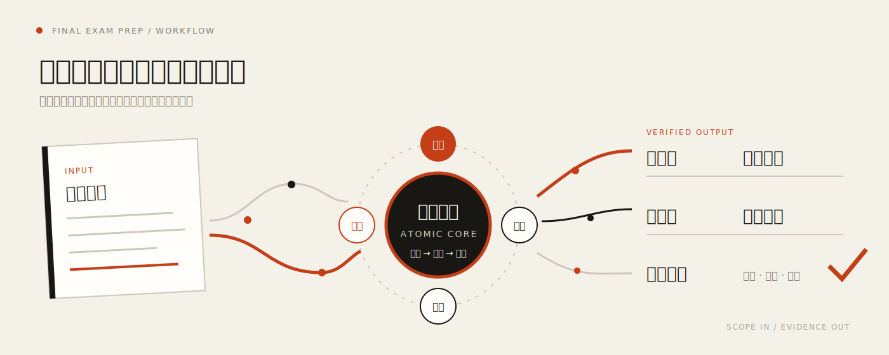

<div align="center">

# Final Exam Prep.skill


<p align="center">
  
  <br/>
  <sub>动态视觉由 <a href="https://github.com/alchaincyf/huashu-design">huashu-design</a> 工作流制作</sub>
</p>

> *“把考试范围编译成行动，让每份复习材料都有依据。”*


<br>

**一套从考试范围出发、按考点检索资料、自动构建复习闭环的智能工作流。**

先拆考点，再读资料；只抽取有用页面，不需要把资料全部阅读。  
知识点、思维导图、题目、答案与来源证据使用稳定 ID 对齐，生成后自动检查遗漏。

[看如何使用](#触发与使用示例) · [看模板矩阵](#模板矩阵) · [看核心创新](#核心创新) · [看工作流](#工作流)

</div>

---

## 模板矩阵

Final Exam Prep 提供一套可组合的复习模板系统。工作流会根据课程和任务选择合适预设，让不同学科采用匹配的知识结构与训练方式。

| 模板层 | 已有模板 | 解决什么问题 |
| --- | --- | --- |
| 5 类学科预设 | 文科、理科、工科、语言、通用竞赛 | 决定考点拆解、知识组织与训练侧重 |
| 3 套复习框架 | 期末三件套、语言复习、竞赛补缺训练 | 决定最终复习材料的整体结构 |
| 4 类题型模板 | 文科论述、计算题、语言练习、竞赛缺口题 | 决定题目、答案与解析如何生成和校验 |

模板采用“学科预设 × 复习框架 × 题型模板”的组合方式：既能服务常规期末，也能覆盖语言学习和竞赛补缺等不同任务。

---

## 触发与使用示例

### 什么时候会触发

- 用户提到“期末”“考试复习”“按考试范围整理”“根据考点出题”等目标；
- 用户希望把考试范围、大纲或教师复习要点整理成知识点、导图、题目和答案；
- 用户同时提供 PDF、PPT、Word、压缩包等课程资料，希望按考点筛选有效内容；
- 用户需要语言复习或竞赛补缺训练，并明确给出学习范围或能力缺口。

如果用户只是询问单个知识点，或只想摘要一份普通文档，则按常规问答或文档总结处理。课程名、考试范围和资料可以一次性提供，信息已经齐全时不会重复追问。

### 一问一答示例

> **用户：** 期末。
>
> **Final Exam Prep：** 好的，请告诉我课程名称。考试范围和课程资料也可以直接一起发来。
>
> **用户：** 数据采集与预处理。这是老师给的期末复习要点和全部课件。
>
> **Final Exam Prep：** 已收到。我会先读取期末复习要点，确认考试范围和题型分布；随后把范围拆成原子考点，再按考点检索课件，只抽取命中页面及必要上下文。完成后交付知识点、思维导图、训练题、答案和覆盖矩阵，并检查来源、考点覆盖与题答同步。
>
> **用户：** 可以，开始吧。
>
> **Final Exam Prep：** 已锁定复习任务，开始建立考点清单。接下来会优先处理考试范围，课程资料将在考点确定后按需抽取。

这段对话触发了 **考点先行**、**稀疏资料抽取**、**来源证据链** 和 **自动质量门禁**。整个流程围绕考试目标组织，用户无需预先整理全部资料。

### 默认交付

| 文件 | 用途 |
| --- | --- |
| `知识点.md / .pdf` | 按原子考点组织的可背诵资料 |
| `思维导图.png / .pdf` | 可视化知识结构 |
| `题目.md / .pdf` | 分层训练题库 |
| `答案.md / .pdf` | 与题目完全同步的答案解析 |
| `coverage_matrix.csv` | 范围、来源和题量覆盖审计 |

### 传统 AI 总结与 Final Exam Prep

| | 传统资料总结 | Final Exam Prep |
| --- | --- | --- |
| 起点 | 打开 PDF 从第一页开始读 | 先锁定考试范围与题型 |
| 资料处理 | 全文转文本、整体压缩 | 按原子考点定向抽取页面 |
| 结果结构 | 一份泛化摘要 | 知识点、导图、题库、答案 |
| 可追溯性 | 很难知道结论来自哪里 | 考点与来源页稳定对齐 |
| 完成标准 | “生成结束” | 覆盖率、题答同步、来源状态全部通过 |

工作流会先建立复习合同，再决定哪些材料值得进入上下文。相较于一次性提示词，它具备稳定的考点映射、来源追踪、题答同步和交付校验；材料越多，定向检索的效率优势越明显。

---

## 核心创新

### 1. 考点先行，资料按需进入

考试大纲、题型分布和教师复习要点拥有最高优先级。系统先把范围拆成能独立定义、比较、说明流程或完成计算的原子考点，再去课程资料中寻找证据。

### 2. 稀疏抽取，拒绝“整本 PDF 搬家”

教材、课件和大型资料默认只登记文件与元数据。建立 `atomic_map.json` 后，`extract_relevant_pdf.py` 才会按考点词汇检索页面，只保存命中页和必要上下文。这同时减少等待时间、无关文本和上下文消耗。

### 3. 从知识到训练的可追溯证据链

```text
考试范围
  └─ atomic_id
      ├─ 来源页与原句
      ├─ 知识点
      ├─ question_id
      └─ 对应答案与解析
```

每道题都知道自己在考什么，每个知识点都知道自己来自哪里。内部追踪信息保存在旁车清单中，不污染用户看到的正式资料。

### 4. 按学习梯度组织训练

同一原子考点的训练题分别覆盖知识记忆、概念理解和应用/计算。选择题拥有有效干扰项，计算题提供数值与过程，开放题给出可以独立复习的具体答案。

### 5. 生成之后还有质量门禁

交付前自动检查：

- 大纲条目和并列子要求是否全部映射到原子考点；
- 每个考点是否存在可验证来源；
- 题目与答案 ID、数量、顺序是否同步；
- 难度比例和题型覆盖是否符合复习合同；
- Markdown、图片和 PDF 是否实际可读。

---

## 工作流

<p align="center">
  
</p>

```text
输入考试范围
→ 拆分原子考点
→ 用户确认复习方案
→ 锁定复习合同
→ 按考点抽取课程资料
→ 生成知识与训练产物
→ 覆盖矩阵和质量门禁
→ Markdown / PNG / PDF 交付
```

<details>
<summary><strong>展开查看技术实现路径</strong></summary>

| 模块 | 作用 |
| --- | --- |
| `import_sources.py --metadata-only` | 登记大型资料，不展开全文 |
| `extract_relevant_pdf.py` | 根据既定原子考点定向抽取 PDF 页面 |
| `build_verbatim_notes.py` | 把选中的来源句组织成复习知识结构 |
| `render_mindmap.py` | 生成本地可直接查看的思维导图图片 |
| `build_atomic_bank.py` | 构建分层题库、答案和内部追踪清单 |
| `validate_review.py` | 校验来源、覆盖、题答同步与交付完整性 |

</details>

---

## 参赛价值

本项目面向 [2026 中国高校计算机大赛—人工智能创意赛·鸿蒙高校创新赛](https://developer.huawei.com/consumer/cn/activity/incentive/C4)。它选择大学生最熟悉、最真实的复习场景，以可验证的 AI 工作流、实用落地能力与完整视觉体验呈现创意价值。

### 市场前景

期末复习是入口，底层能力可以扩展到考研专业课、职业资格认证、企业培训和课程助教。个人用户获得更低的资料整理成本；教师获得可审计的考点覆盖与题库草案；机构获得标准化、可复用的课程知识资产。

潜在模式包括基础整理免费、深度题库订阅和机构课程知识库服务。持续积累的“考试范围—课程资料—原子考点—训练效果”结构化图谱，将形成超越单次摘要的长期价值。

---

## 仓库结构

```text
final-exam-prep/
├─ README.md
├─ SKILL.md
├─ assets/
│  ├─ hero.gif
│  ├─ fep-logo.svg
│  ├─ interaction-flow.svg
│  └─ final-exam-prep-poster.svg
├─ workflows/
├─ references/
├─ templates/
├─ scripts/
└─ demo/
```

---

<div align="center">

**少读无关内容，多做有效复习。**

让每一次生成，都知道自己为什么出现。

</div>
