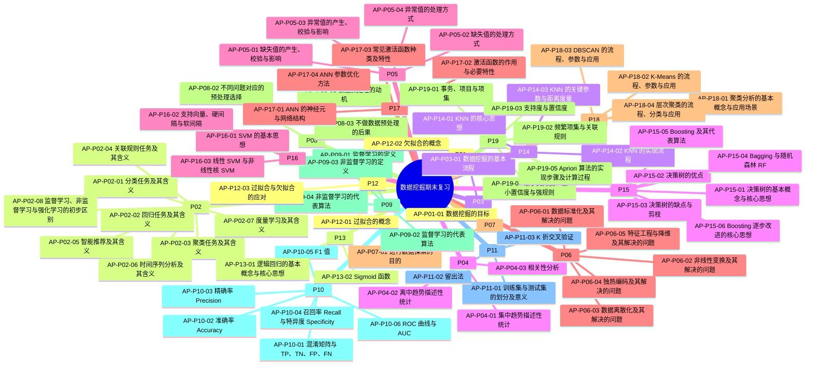

# 思维导图

```mermaid
mindmap
  root((数据挖掘期末复习))
    P01
      AP-P01-01 数据挖掘的目标
    P02
      AP-P02-01 分类任务及其含义
      AP-P02-02 回归任务及其含义
      AP-P02-03 聚类任务及其含义
      AP-P02-04 关联规则任务及其含义
      AP-P02-05 智能推荐及其含义
      AP-P02-06 时间序列分析及其含义
      AP-P02-07 度量学习及其含义
      AP-P02-08 监督学习、非监督学习与强化学习的初步区别
    P03
      AP-P03-01 数据挖掘的基本流程
    P04
      AP-P04-01 集中趋势描述性统计
      AP-P04-02 离中趋势描述性统计
      AP-P04-03 相关性分析
    P05
      AP-P05-01 缺失值的产生、校验与影响
      AP-P05-02 缺失值的处理方式
      AP-P05-03 异常值的产生、校验与影响
      AP-P05-04 异常值的处理方式
    P06
      AP-P06-01 数据标准化及其解决的问题
      AP-P06-02 非线性变换及其解决的问题
      AP-P06-03 数据离散化及其解决的问题
      AP-P06-04 独热编码及其解决的问题
      AP-P06-05 特征工程与降维及其解决的问题
    P07
      AP-P07-01 进行数据探索的目的
    P08
      AP-P08-01 数据预处理的动机
      AP-P08-02 不同问题对应的预处理选择
      AP-P08-03 不做数据预处理的后果
    P09
      AP-P09-01 监督学习的定义
      AP-P09-02 监督学习的代表算法
      AP-P09-03 非监督学习的定义
      AP-P09-04 非监督学习的代表算法
    P10
      AP-P10-01 混淆矩阵与 TP、TN、FP、FN
      AP-P10-02 准确率 Accuracy
      AP-P10-03 精确率 Precision
      AP-P10-04 召回率 Recall 与特异度 Specificity
      AP-P10-05 F1 值
      AP-P10-06 ROC 曲线与 AUC
    P11
      AP-P11-01 训练集与测试集的划分及意义
      AP-P11-02 留出法
      AP-P11-03 K 折交叉验证
    P12
      AP-P12-01 过拟合的概念
      AP-P12-02 欠拟合的概念
      AP-P12-03 过拟合与欠拟合的应对
    P13
      AP-P13-01 逻辑回归的基本概念与核心思想
      AP-P13-02 Sigmoid 函数
    P14
      AP-P14-01 KNN 的核心思想
      AP-P14-02 KNN 的实现流程
      AP-P14-03 KNN 的关键参数与距离度量
    P15
      AP-P15-01 决策树的基本概念与核心思想
      AP-P15-02 决策树的优点
      AP-P15-03 决策树的缺点与剪枝
      AP-P15-04 Bagging 与随机森林 RF
      AP-P15-05 Boosting 及其代表算法
      AP-P15-06 Boosting 逐步改进的核心思想
    P16
      AP-P16-01 SVM 的基本思想
      AP-P16-02 支持向量、硬间隔与软间隔
      AP-P16-03 线性 SVM 与非线性核 SVM
    P17
      AP-P17-01 ANN 的神经元与网络结构
      AP-P17-02 激活函数的作用与必要特性
      AP-P17-03 常见激活函数种类及特性
      AP-P17-04 ANN 参数优化方法
    P18
      AP-P18-01 聚类分析的基本概念与应用场景
      AP-P18-02 K-Means 的流程、参数与应用
      AP-P18-03 DBSCAN 的流程、参数与应用
      AP-P18-04 层次聚类的流程、分类与应用
    P19
      AP-P19-01 事务、项目与项集
      AP-P19-02 频繁项集与关联规则
      AP-P19-03 支持度与置信度
      AP-P19-04 最小支持度、最小置信度与强规则
      AP-P19-05 Apriori 算法的实现步骤及计算过程
```
